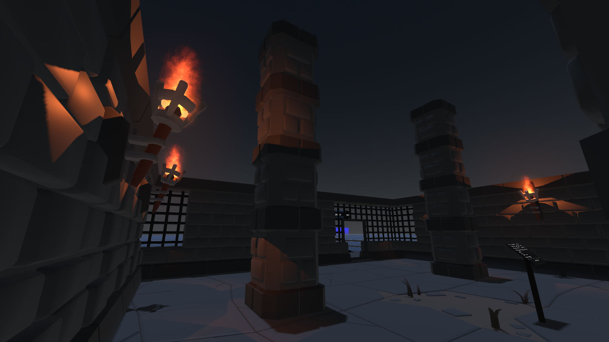
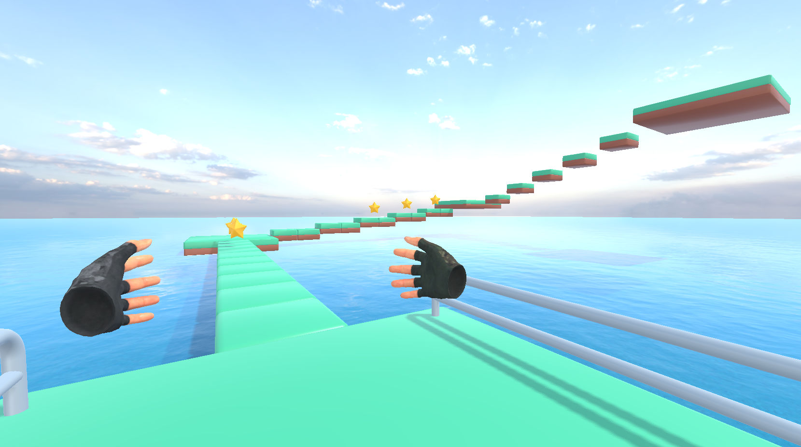
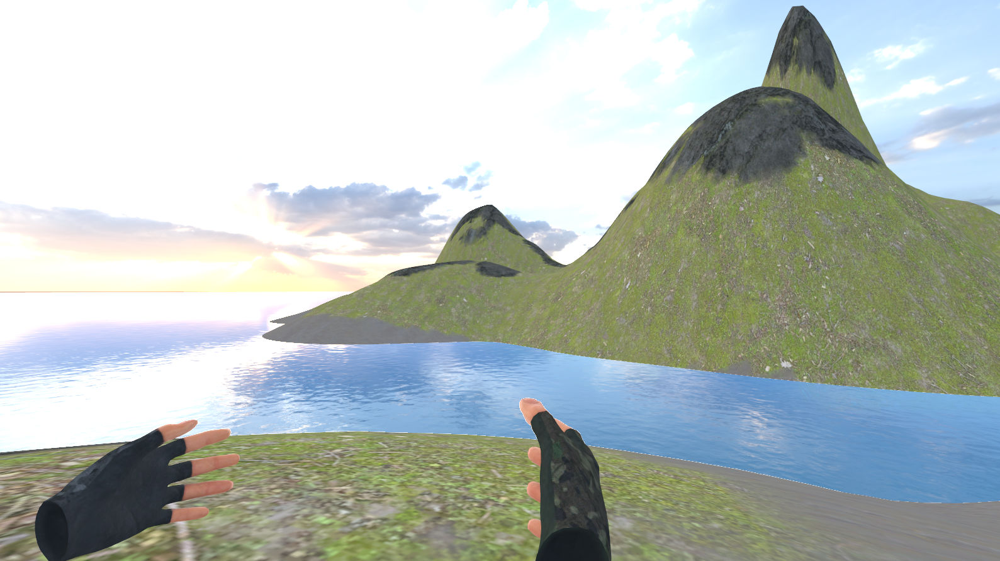

# godot-xr-game-demo

This is a Godot XR game demo to get some experience with Godot 4 and XR.

## Acknowledgements

Many thanks to

* The [Godot Game Engine](https://godotengine.org/) and the [Godot Community](https://godotengine.org/community/).
* [Bastiaan Olij](https://github.com/BastiaanOlij), [Malcolm Nixon](https://github.com/Malcolmnixon) and others for the awesome [Godot XR Tools](https://github.com/GodotVR/godot-xr-tools).
* Roope Palmroos and Cory Petkovsek for the great [Terrain3D](https://github.com/outobugi/Terrain3D) addon.
* [Aerton Oliveira](https://github.com/Cafezinhu) for the [Godot VR Simulator](https://github.com/Cafezinhu/godot-vr-simulator).
* Kay Lousberg for the [KayKit Mini-Game Variety Pack](https://kaylousberg.itch.io/kay-kit-mini-game-variety-pack) (platform assets).
* [StayAtHomeDev](https://stayathomedev.com/) for the water shader.
* Creators of materials at [Poly Haven](https://polyhaven.com).
* Creators of sounds at [Freesound](https://freesound.org/).

